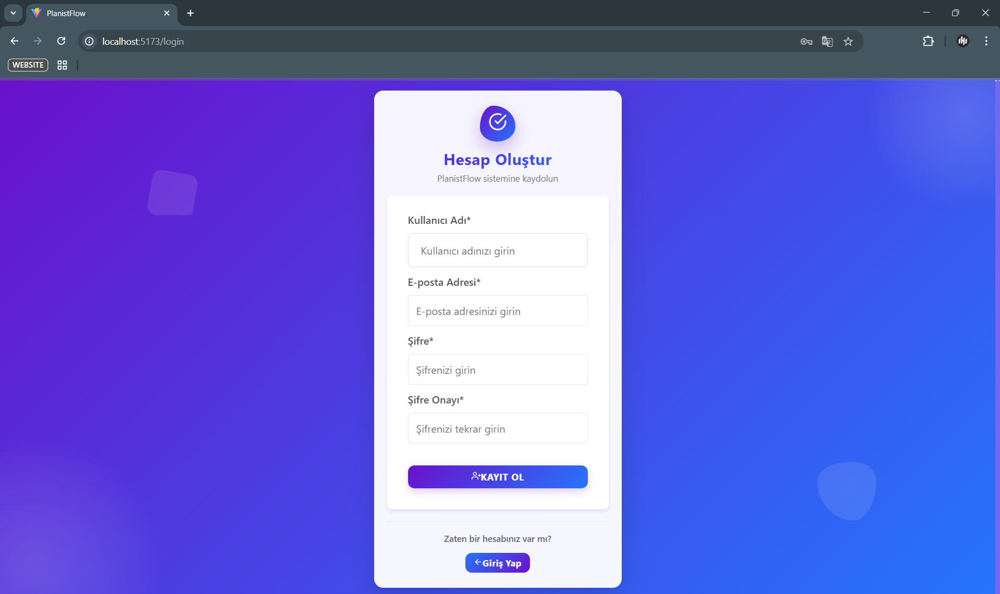
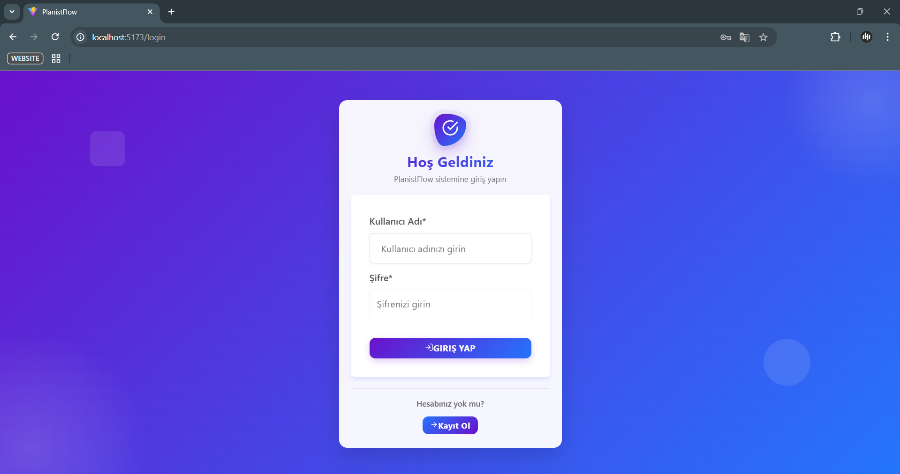
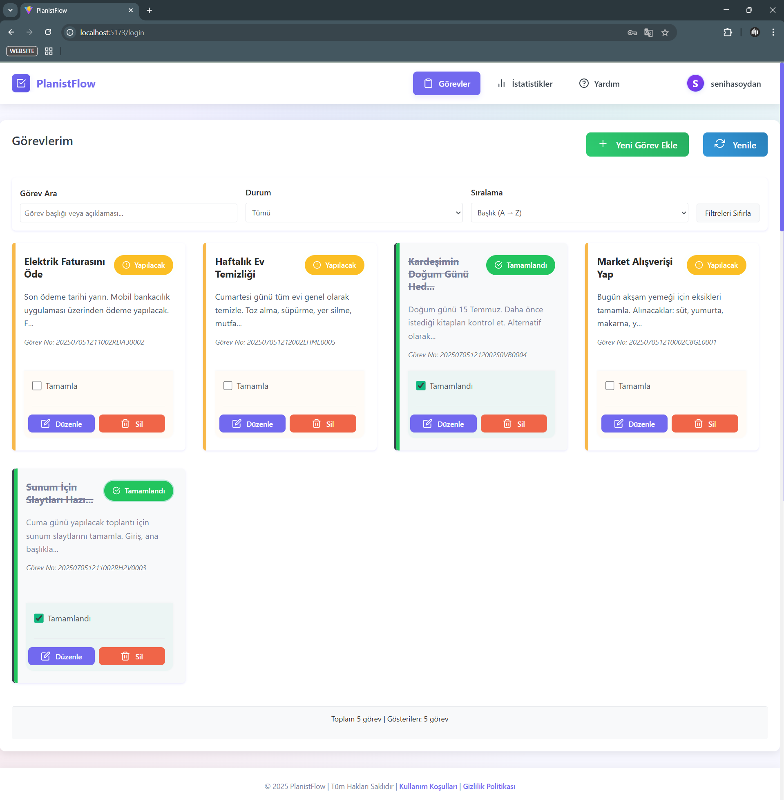
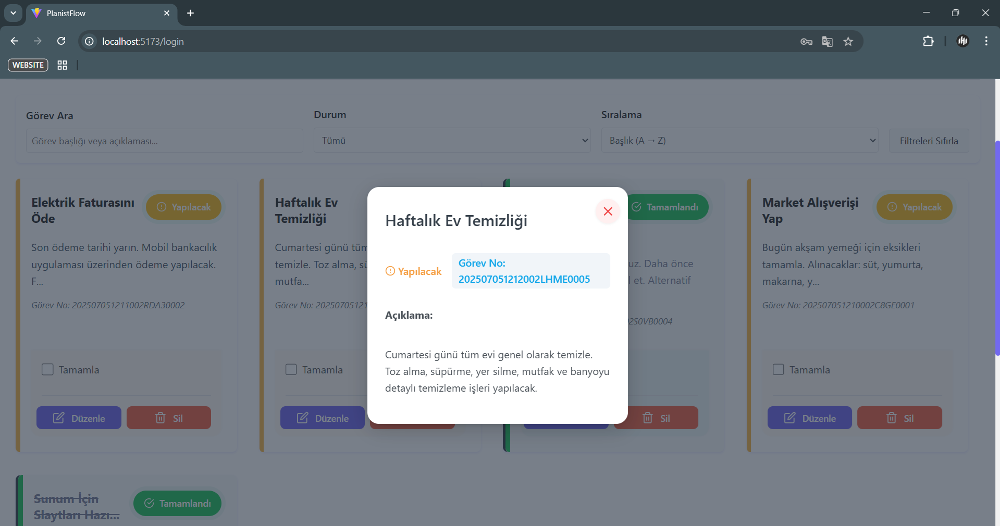
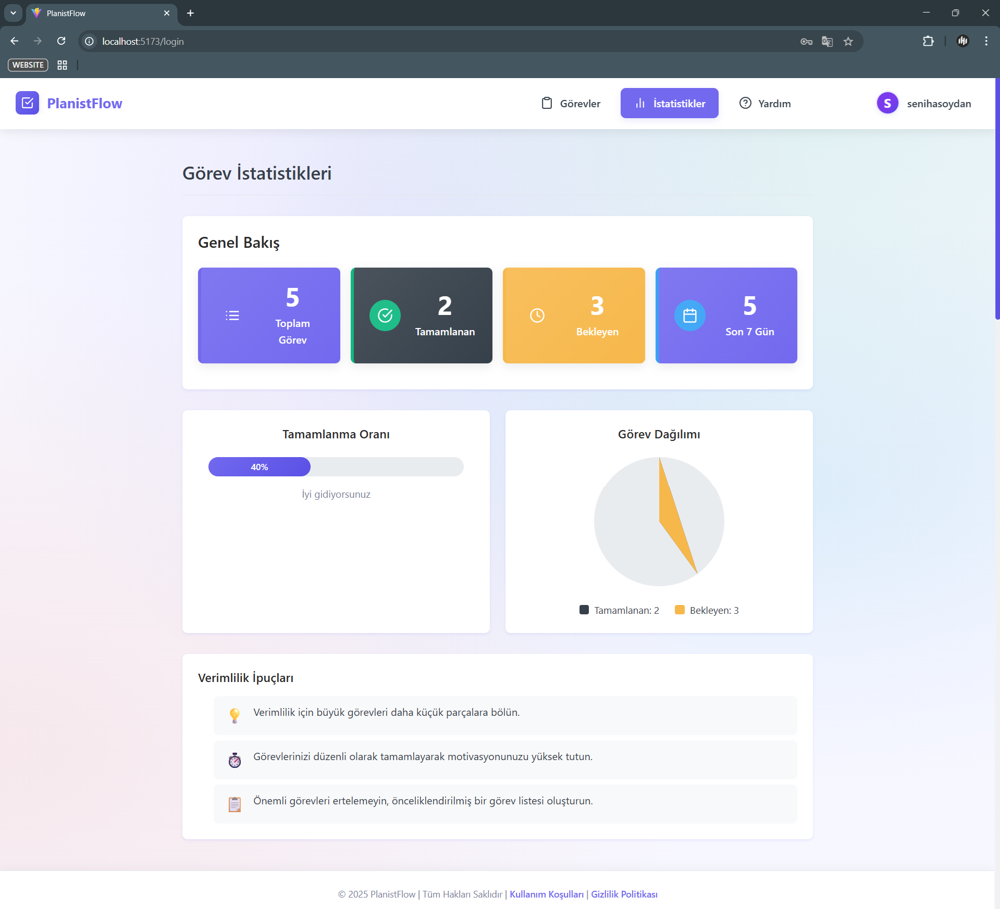
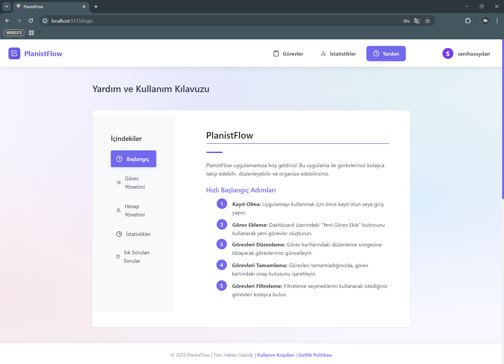
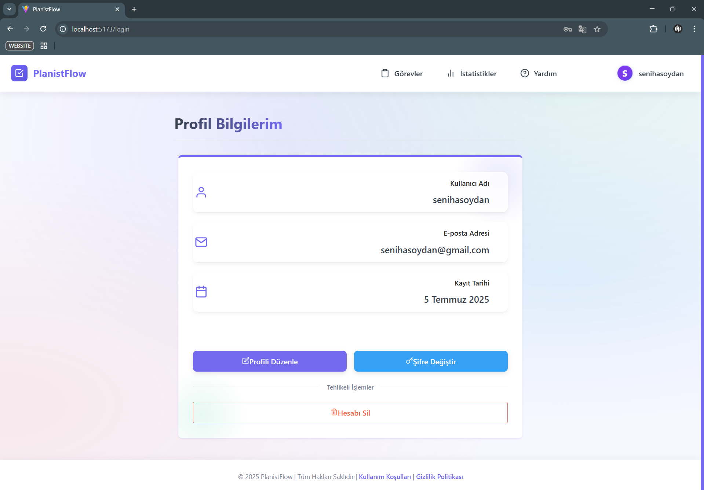

# PlanistFlow

PlanistFlow is a modern, full-featured task and productivity management web application designed to help you organize, track, and complete your daily work with ease. Built with the latest technologies, PlanistFlow offers an intuitive and visually appealing user interface, real-time task tracking, detailed productivity statistics, and comprehensive user management features. Whether you're managing personal to-dos or collaborating with a team, PlanistFlow provides all the tools you need to stay productive and organized.

Key features include:
- Fast and responsive UI for seamless user experience
- Real-time task creation, editing, completion, and filtering
- Visual statistics to monitor your productivity and completed tasks
- Secure authentication and user profile management
- Modern, mobile-friendly design for use on any device
- Suitable for both individual users and teams

## Technologies Used

- **React 19** — Modern, component-based UI library
- **Vite** — Lightning-fast build tool and dev server
- **React Router v7** — Declarative client-side routing
- **Axios** — Promise-based HTTP client for API requests
- **ESLint** — Code quality and linting
- **Modern CSS** — Responsive, accessible, and custom design

## Screenshots

### Register


### Login


### Homepage


### Add New Task


### Task Detail


### Task Statistics


### Help & User Guide


### Profile


## Features

- 📝 **Real-Time Task Management:** Instantly create, edit, complete, and delete tasks with a seamless user experience.
- 🔍 **Advanced Filtering & Sorting:** Filter tasks by status, search by text, and sort by title, description, or completion state.
- 📊 **Productivity Statistics:** Visualize your progress and completed tasks with interactive statistics and charts.
- 👤 **User Profile Management:** View and update your profile, change your password, and manage your account securely.
- 🔒 **Secure Authentication:** Register and log in with robust security, including JWT-based authentication.
- 🌐 **Responsive & Modern Design:** Enjoy a clean, mobile-friendly interface that works perfectly on all devices.
- 👥 **Personal & Team Use:** Suitable for individual productivity or collaborative team task management.
- ⚡ **Error Handling & Feedback:** User-friendly error messages and feedback for all actions.
- ♿ **Accessibility:** Designed with accessibility best practices for an inclusive user experience.

## Getting Started

### Prerequisites
- Node.js >= 18.x
- npm >= 9.x

### Installation

```bash
cd task-management-frontend
npm install
```

### Running the App

```bash
npm run dev
```

The app will be available at [http://localhost:5173](http://localhost:5173)

### Build for Production

```bash
npm run build
```

## Project Structure

- `src/` — Main source code
  - `components/` — Reusable UI components
  - `pages/` — Application pages (Dashboard, Profile, Help, etc.)
  - `services/` — API and business logic
  - `context/` — React context for authentication, etc.
  - `assets/` — Images and static files

## Backend
PlanistFlow requires the backend service to be running. See the [PlanistFlow Backend](https://github.com/hsynkbulut/PlanistFlow-Backend) repository for backend setup and instructions.

## License

This project is licensed under the BSD 3-Clause License. For details, please see the [LICENSE](LICENSE) file.

---

© 2025 PlanistFlow. All rights reserved.
